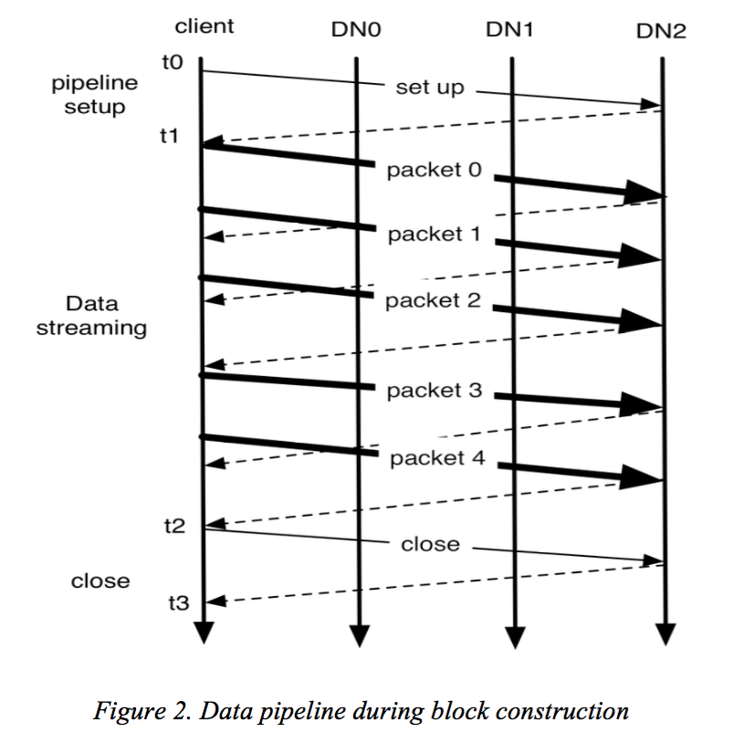

# Hadoop Distributed File System 

Since HDFS is quite similar to GFS, to me, it's just an open-source GFS 2.0, I will not go into details on many subjects in this paper. 

## Architecture

#### NameNode and DataNode

​	In short, the architecture of HDFS is quite similar to GFS. They both adopt centralized structure, where  in HDFS the NameNode is the master in GFS and DataNodes are chunkservers. Just like in GFS, NameNode handles the metadata. It maintains the namespace tree and mapping of files blocks to DataNodes. Typically, each cluster has a NameNode and lots of DataNode. 

NameNode can run as either *CheckpointNode* or *BackupNode*. 

​	HDFS keeps the entire namespace in RAM. It also uses checkpoint and journal to provide fault recovery. Note, the location of DataNode is not stored in the checkpoint. 

​	The DataNode also uses checksum to prevent data lost. It stores two file for each block replica, one for data and one for metadata including checksum and *generation stamp*. Version number is used to remove stale data. Namespace ID is used to decide whether DataNode belongs to a cluster. 

​	During normal operation, DataNode sends *heartbeats* to the NameNode. Heartbeats carry information of the DataNode, like storage capacity, number of data transfers in progress. The NameNode replies to heartbeats to send instructions, including:

- replicate blocks to other nodes
- remove local block replicas
- re-register or shut down the node
- send an immediate block report, (which is a summary of a block's information)

#### Image and Journal

The namespace *image* is the file system metadata that describes the organization of application data as directories and files. A persistent record of the image written to disk is called a *checkpoint*. 

The journal is in fact a *write-ahead log*, which is a technique widely applied in modern database. For each transaction, the change is recorded in the journal, and the journal file is flushed and synched before the change is committed. 

This design has a drawback, since NameNode is a multithread system, saving a transaction to the disk may become a bottleneck as all other thread need to wait. The HDFS optimize this by batching transactions to save. 

## File I/O Operation

#### File Read & Write

After a file is closed, the bytes written cannot be altered or removed except that new data can be appended to the end. HDFS also implements a single-writer, multiple reader model. It uses *lease* to grant permission to client, just as GFS, which means write with concurrent read is supported as well.

When writing files, push sequence of packets on a *pipeline* to write to blocks that stores the file and its replicas. Need to setup and close the pipeline before and after write. Note, in the figure, a *hflush* operation is conducted right after packet 2 is sent. It will force the client to wait for the confirm information of packet 2 received before sending packet 3. 

#### Block Placement and Others

As in GFS, HDFS tends to split replicas on different machines and also different racks. The default HDFS replica placement policy can be summa- rized as follows:

1. No Datanode contains more than one replica of any block.
2. No rack contains more than two replicas of the same block, provided there are sufficient racks on the cluster.

Other functionalities provided by HDFS include balancer, a tool to balance disk usage on cluster, and block scanner, which periodically scans a block's replicas and verifies the checksum.

*In my thought, some of the mechanism in HDFS are just grouping functions in GFS into small units and manage them separately.*

## Conclusion

The rest of the paper is practice experience, future works and acknowledgement. In short, HDFS is a powerful distributed system, which is like an open-source,  upgraded GFS.

One final thing to note, the major drawback of having many namespaces is the cost of managing them. I guess that's an important reason for YARN to show up. 

## Reference

[1] K V Shvachko, H Kuang, S Radia, R Chansler, Yahoo!. 2010. *The Hadoop Distributed File System*